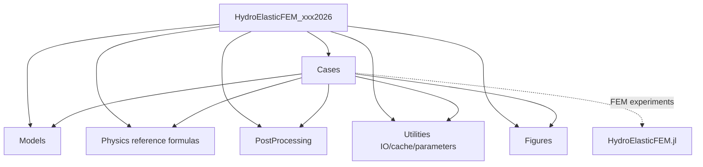

# Paper-reproduction repository audit

## Scope and boundary

This repository orchestrates paper experiments and owns their configurations,
post-processing, exports, and figures. `HydroElasticFEM.jl` remains the
authoritative dependency for finite-element operators, weak forms, assembly,
meshes, physics kernels, and solvers. The analytical Appendix-A dispersion
formula currently used for the non-dissipative homogeneous isotropic LRH
dispersion subsection remains here because it is a paper-specific closed-form
reference, not an FEM implementation.

## 1. Current audit

### Strengths

- The package has a small, testable analytical kernel.
- The Appendix-A branches and Liu et al. parameter fixture are already covered
  by tests.
- The dispersion subsection runner produces both standalone plots and a CSV artifact.
- The generated output has a stable, manuscript-oriented directory.

### Weaknesses and classification

| Current function or block | Classification | Issue |
| --- | --- | --- |
| `PlateParameters`, `ResonatorParameters` | Model definition | Correct ownership, but mixed with all other concerns. |
| `liu_2025_parameters` | Model definition / fixture | A paper fixture was exported from the package root. |
| `fluid_added_mass`, `restoring_coefficient` | Model definition | Analytical reference model; should be isolated from orchestration. |
| `effective_mass`, `bare_dispersion`, `metaplate_dispersion` | Model definition | Scientific formulas are suitable for a focused physics file. |
| `physical_wavenumber`, `case_curves` | Numerical experiment | Hard-coded script state made the sweep difficult to reuse. |
| `bandgap_limits`, `add_bandgap_shading!` | Post-processing / figure generation | Data reduction and rendering were coupled. |
| `make_panel` and the top-level loops | Figure generation | Plotting, case selection, and file naming were one script. |
| CSV `open` block | Utility / export | Serialization was not reusable or independently testable. |

The refactor now separates these active responsibilities into `Models`,
`Physics`, `PostProcessing`, `Utilities`, `Figures`, and `Cases`. The old
script is a thin compatibility entry point.

## 2. Target hierarchy

```text
src/
├── HydroElasticFEM_xxx2026.jl       # package composition and public API
├── Cases/
│   └── RunAll.jl                     # aggregate manuscript workflow
├── Models/
│   └── Configurations.jl             # membrane/resonator/wave configurations
├── Physics/
│   └── Dispersion.jl                 # paper-specific closed-form reference
├── PostProcessing/
│   └── Dispersion.jl                 # tables and band-gap metrics
├── Sections/
│   └── dispersion_theory/
│       ├── homogeneous_isotropic.jl
│       ├── homogeneous_isotropic_plot.jl
│       ├── frequency_graded.jl
│       ├── frequency_graded_plot.jl
│       ├── frequency_graded_run.jl
│       └── frequency_graded_3d.jl
└── Utilities/
    └── IO.jl

data/generated/
└── dispersion_theory/
  └── homogeneous_isotropic/
    ├── dispersion.csv
    └── *.png
```

The section directories are the manuscript-facing layer. The Julia package
files hold reusable functions; each subsection runner selects a configuration,
calls the numerical workflow, and writes artifacts. A future manuscript
subsection should receive its own directory using its section title and
subsection title, without encoding the figure number.

## 3. Include hierarchy

```julia
module HydroElasticFEM_xxx2026
using Plots
using LaTeXStrings

include("Models/Configurations.jl")
include("Physics/Dispersion.jl")
include("PostProcessing/Dispersion.jl")
include("Utilities/IO.jl")
include("Sections/dispersion_theory/homogeneous_isotropic.jl")
include("Sections/dispersion_theory/homogeneous_isotropic_plot.jl")
include("Cases/RunAll.jl")
end
```

The frequency-graded subsection uses the local WKB closure from manuscript
section 3.2.1. Its four separate plots compare linear and exponential profiles
for zero and positive pre-tension. Curves are sampled at fixed normalized
positions and use the Liu reference range $\omega_r\in[1,10]$ rad/s, with the
same $k/\sqrt{n_0}\in[-\pi,\pi]$ and $\omega\in[0,15]$ limits as the
homogeneous dispersion figure.

For band-gap inspection, the same four cases also produce interactive PlotlyJS
HTML surfaces. Each surface has $k/\sqrt{n_0}$ on the first axis, $x/L$ on the
second, and $\omega$ on the third. The lower and upper surfaces are rendered
separately, with a translucent midpoint surface marking the gap between them.
Open the HTML files in a browser and rotate, zoom, or hover over the surfaces.

```julia
using HydroElasticFEM_xxx2026
run_frequency_graded_3d()
```

```julia
using HydroElasticFEM_xxx2026
run_frequency_graded_dispersion()
```

Includes are ordered from data definitions to computations, then exports and
case orchestration. No case file should implement FEM operators or solver
logic; those calls should be made through the `HydroElasticFEM.jl` API.

## 4. Dependency graph



The dependency direction is intentionally one-way. Figures consume processed
tables; they do not recompute physics. Cases compose the dependency graph;
they do not define shared numerical kernels.

## 5. Ordered pull-request plan

1. **PR 1: package composition and subsection extraction.** Land the current
  `Models`, `Physics`, `PostProcessing`, and section/subsection split while
  preserving the public analytical API.
2. **PR 2: reproducibility contract.** Add `parameters.toml`, deterministic
   output manifests, cache keys, and a `run.jl/process.jl/plot.jl` layout for
  the non-dissipative homogeneous isotropic LRH dispersion subsection.
3. **PR 3: HydroElasticFEM adapter.** Add a small adapter layer that calls the
   authoritative FEM package without copying its operators or solver code.
4. **PR 4: additional dispersion subsections.** Add avoided-crossing and
  undamped-response runners, each organized under its manuscript subsection.
5. **PR 5: response subsections.** Add damping and band-gap studies, including
   reflection/transmission, absorption, and energy metrics in PostProcessing.
6. **PR 6: parameter-study workflow.** Add parameter sweeps, cache-aware
  execution, `generate_all_figures()`, and a CI reproduction smoke test.
7. **PR 7: documentation and release archive.** Add Documenter.jl pages,
   environment instructions, artifact checksums, and a reviewer quick-start.

## 6. Julia practice checklist

- Keep configuration immutable and concrete, with one parameter type per
  physical object.
- Pass grids and configurations as arguments; avoid mutable module globals.
- Use dotted broadcast for pointwise sweeps and return named tuples or typed
  result structs at module boundaries.
- Keep plotting out of numerical functions and serialization out of case
  definitions.
- Use Unicode identifiers such as `ρ`, `ωᵣ`, `Kᵣ`, `β`, and `γ` where they
  match manuscript formulas; retain descriptive names for public APIs.
- Add narrow tests for formulas, result table shapes, file schemas, and one
  end-to-end figure runner per manuscript figure.
- Run `julia --project=. -e 'using Pkg; Pkg.test()'` before publishing data.

## 7. Reviewer workflow

```julia
using HydroElasticFEM_xxx2026
generate_all_figures()
```

At the current repository state this regenerates the implemented
non-dissipative homogeneous isotropic LRH dispersion artifacts. As additional
subsections land, `RunAll.jl` is the single place where they are registered, so
the reviewer command stays stable while the manuscript grows.